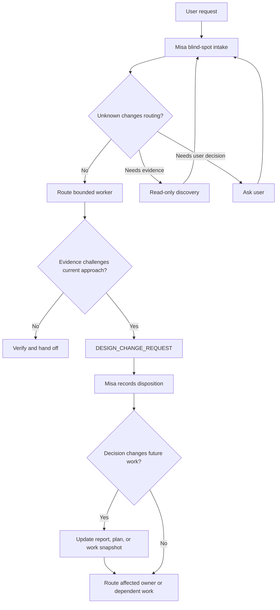

# Misa–Herdr kit

Portable Misa coordinator policy and a constrained Herdr controller for an OMP
workspace.

## What this installs

- `.misa-herdr/`: launcher, OMP overlay, Herdr extension, command allowlist, and
  local verification scripts.
- `.claude/agents/`: Misa, Git manager, and portfolio-curator role definitions.
- `.claude/skills/`: Misa Herdr, adaptive delivery, evidence, cross-provider
  review, and portfolio skills.
- `.agents/skills/`: OMP-discoverable adapters for the evidence and review skills.
- `templates/workspace-policy/`: portable `AGENTS.md`, `CLAUDE.md`,
  `identities.md`, and `.organization/` authority/routing templates.

The controller is intentionally limited to listing, reading, waiting for,
prompting, and starting registered Herdr agents, plus splitting a worker pane. It
does not execute arbitrary shell commands, read files, write files, or create
worktrees. Git owns branches and worktrees; Herdr owns panes and agent lifecycle.

## What coordination problems it addresses

This kit separates coordination from implementation. Misa keeps the user’s outcome,
authority boundaries, ownership, dependencies, and acceptance conditions in view.
Workers inspect source, test hypotheses, make scoped changes, and return compact
evidence-backed handoffs.

The policy is designed for a few recurring failures in multi-agent work:

- A task brief turns a current design into an unchallenged requirement.
- A worker finds evidence against that design but can only return a local workaround.
- Several workers change or depend on the same area without a clear owner.
- A decision made in a transient message never reaches the worker whose next step
  depends on it.

Misa performs a short blind-spot intake before routing a request. It separates the
outcome, non-negotiable constraints, revisable approaches, and unknowns. It does not
spawn a critic for every prompt. A read-only scout is used only when an unknown needs
evidence and could change the route; a user question is reserved for a user-owned
decision.

When a worker has evidence that a current approach no longer serves the outcome, it
can send a `DESIGN_CHANGE_REQUEST`. The request names the premise, evidence, impact,
options, and requested disposition. Misa either keeps the approach with a reason,
permits a local adaptation, routes the work to the owner, or asks the user. The worker
does not edit another owner’s scope. If the decision changes future work, it is written
to the task’s report, plan, or work snapshot before affected work continues.



The kit does not prove that a design is correct, that a test suite covers every failure
mode, or that a worker will find every bad premise. Verification and independent review
reduce specific risks when the task warrants them. They do not replace technical
judgment or user decisions.

## Model routing: review and customize before use

The bundled routes are an initial policy from the source workspace, not a claim
that these models remain current, available, affordable, or appropriate for your
account. Choose the providers, model IDs, thinking tiers, and escalation policy
yourself before deployment. A user-specified model or provider takes precedence.

Current baseline:

| Work | Route in the kit |
| --- | --- |
| Misa coordinator | `anthropic/claude-fable-5-1`, `high` |
| Routine plan/debug/implementation | Sonnet 5.5, normally `medium` |
| Review of Anthropic-authored work | Codex GPT-6 Luna, `high` |
| Independent review of Codex-authored work | Sonnet 5.5, `high` |
| Deep RCA/high-stakes plan | Opus 5.5 only with user request/approval or verified insufficiency evidence |
| Git/GitHub write | Codex GPT-6 Luna, `low`, through `git-manager` only |

When changing routing, update the owners together:

- `templates/.misa-herdr/bin/misa-controller` for the coordinator default.
- `templates/.claude/skills/misa-herdr/references/model-routing.md` for worker
  routes and escalation policy.
- `templates/.claude/skills/misa-cross-agent-review/SKILL.md` for independent
  review routing.
- `templates/.claude/agents/misa.md` and `git-manager.md` when a role boundary or
  Git-write route changes.

Then install into a temporary workspace and run the two Node checks below before
reinstalling into a real project. Do not edit only the README: it is navigation;
the template files above are the active policy after installation.

## Before installation

This kit does not install Herdr, OMP, Node.js, credentials, models, Git remotes,
or a profile index. Confirm `herdr`, `omp`, `node`, and the intended model/provider
are already available in the target environment. The included model routes are
policy defaults, not proof that a model is available to the target account.

Run a dry run first:

```bash
./install.sh --target /absolute/path/to/project --dry-run
```

If every listed destination is acceptable, install without overwrite:

```bash
./install.sh --target /absolute/path/to/project
```

The installer stops on an existing managed destination. `--force` overwrites only
the kit-managed files/directories; it never deletes a target directory, but it can
replace a same-named file. Inspect the dry-run output immediately before using it.

For a new workspace that has no established root agent policy, include the optional
authority/routing layer only after reviewing it:

```bash
./install.sh --target /absolute/path/to/project --with-workspace-policy --dry-run
./install.sh --target /absolute/path/to/project --with-workspace-policy
```

Do not use this option casually in an existing workspace: the root files define
local authority and instructions and may already be owned by that project.

### Set Claude's default agent without replacing settings

To set Claude Code's default agent, use the separate opt-in flag:

```bash
./install.sh --target /absolute/path/to/project --set-default-agent --dry-run
./install.sh --target /absolute/path/to/project --set-default-agent
```

If `<target>/.claude/settings.json` already exists, the installer asks before
changing it. On approval it parses that JSON object and changes only its top-level
`"agent"` value to `"misa"`; all other JSON keys remain. Invalid JSON stops the
installation at this step rather than guessing how to repair the file.

Validate the copied controller before starting it:

```bash
cd /absolute/path/to/project
node .misa-herdr/scripts/test-misa-herdr-commands.cjs
node .misa-herdr/scripts/verify-misa-controller.cjs
```

To start the coordinator from a Herdr-managed pane:

```bash
./.misa-herdr/bin/misa-controller
```

The extension refuses `herdr_control` unless `HERDR_ENV=1`. Starting the launcher
from an ordinary terminal may open an OMP chat but cannot control Herdr workers.

## Manual installation if the script is unavailable

Copy these source paths to the same relative paths in the target; do not copy the
whole target's `.claude/` or `.agents/` directory over an existing project:

```text
templates/.misa-herdr/                         -> <target>/.misa-herdr/
templates/.claude/agents/{misa,git-manager,portfolio-curator}.md
                                                -> <target>/.claude/agents/
templates/.claude/skills/misa-*/               -> <target>/.claude/skills/
templates/.agents/skills/misa-*/               -> <target>/.agents/skills/
```

For the optional default-agent setting, use a JSON-aware editor or run the included
`<target>/.misa-herdr/scripts/set-default-agent.cjs <target>/.claude/settings.json`.
It preserves existing top-level keys and sets only `"agent": "misa"`; do not replace
the entire settings file with a one-line example.

Create missing parent directories only. Compare any existing same-named target
file before replacing it. Then run both Node verification commands above. Do not
manually set `HERDR_ENV`; it is a boundary signal inherited from an actual
Herdr-managed pane, not a configuration switch.

## Profile index is deliberately not installed

A project/portfolio index is user-owned state. This kit provides only the
progressive-disclosure mechanism in `misa-portfolio`; it does not invent projects,
statuses, owners, or priorities. Create such an index from verified target evidence.

Use this prompt with Codex, Claude, or another coding agent after installing the kit:

```text
Create a Markdown-first project index for this workspace using progressive
disclosure. First inspect only the root instructions, repository layout, and
existing durable docs. Then create a compact index that routes from workspace to
one project card, then (only when needed) to current work snapshots and cited
authoritative source/Git/test evidence. Preserve unknowns as needs-confirmation.
Do not infer owner, priority, deadline, release state, project status, or facts from
chat history. Do not copy terminal transcripts, secrets, customer data, or plans as
the source of truth. Report each created path and the evidence used.
```

## Runtime-binding warning

The kit ships the Misa role and canonical skills, but it does not claim that every
OMP version automatically loads `.claude/agents/misa.md` or
`.claude/skills/misa-herdr/`. The included launcher definitely loads the constrained
extension. Verify your OMP version's role and project-skill discovery behavior in a
non-production session before relying on Misa's prompt-level policy. The
`.agents/skills/` files are adapters that point to canonical `.claude/skills/`
content; do not maintain two full policy copies.

## Scope notes

`templates/workspace-policy/` contains optional `AGENTS.md`, `CLAUDE.md`,
`identities.md`, and `.organization/` templates for manual merge or the explicit
`--with-workspace-policy` mode. They are never installed by default because the
target's authority and repository rules are local decisions.
